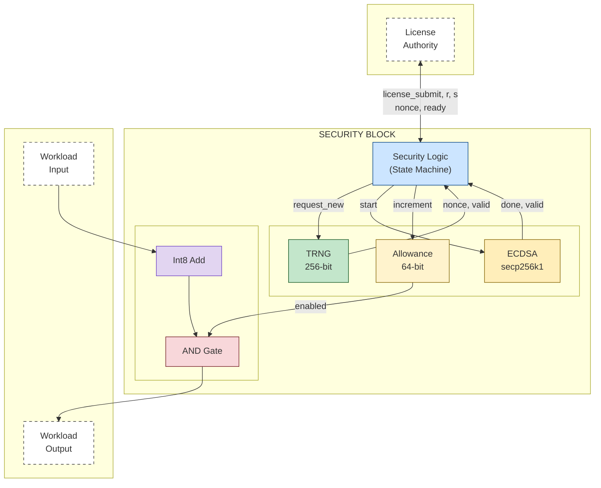
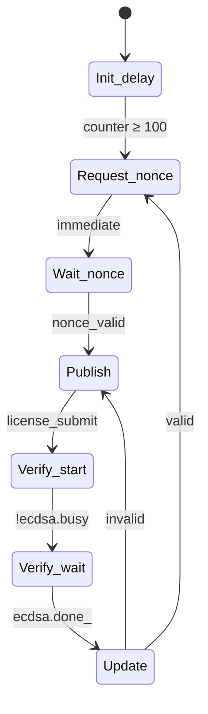

# Security Block Architecture Documentation

## Table of Contents
- [Purpose](#purpose)
- [High-Level Block Diagram](#high-level-block-diagram)
- [Data Flow](#data-flow)
- [Trust Model](#trust-model)
- [Security Properties](#security-properties)
- [Interface Specification](#interface-specification)
- [State Machine](#state-machine)
- [Timing Characteristics](#timing-characteristics)
- [Test Coverage](#test-coverage)
- [Prototype Limitations](#prototype-limitations)
- [Configuration Parameters](#configuration-parameters)

---

## Purpose

The security block implements a hardware-level "deadman's switch" for AI accelerators, as described in Petrie's "Embedded Off-Switches for AI Compute" paper. The block gates essential chip operations, allowing them to proceed only when valid, cryptographically-signed authorization has been recently received.

### Design Goals

- **Fail-secure default**: Output is blocked unless explicitly authorized
- **Cryptographic authorization**: Only holders of the private key can generate valid licenses
- **Replay prevention**: Each license is valid for exactly one nonce
- **Time-based depletion**: Authorization expires over time without renewal

---

## High-Level Block Diagram

*Security block architecture. The Int8 adder is a placeholder for actual chip operations (matrix multiplies, data routing, etc.).*

### Module Summary

| Module | Type | Purpose |
|--------|------|---------|
| `Trng` | Submodule | Nonce generation (256-bit counter in prototype; ring oscillator in production) |
| `Ecdsa` | Submodule | Signature verification using secp256k1 curve |
| Security Logic | Inline | State machine orchestration (7 states) |
| Usage Allowance | Inline | 64-bit authorization counter |
| Workload | Inline | Gated essential operation (Int8 Add example) |

---

## Data Flow

### Authorization Flow

1. TRNG generates nonce (at initialization or after valid license)
2. Security Logic latches and publishes nonce (`nonce_ready` = 1)
3. External authority reads nonce, signs it with private key
4. Authority submits license (r, s) via `license_submit` pulse
5. ECDSA verifies signature against nonce and hardcoded public key
6. **If valid:**
   - Allowance incremented
   - Return to step 1 (new nonce generated)
7. **If invalid:**
   - Allowance unchanged
   - Same nonce retained (allows retry with correct signature)
   - Return to step 2

### Workload Flow

1. Workload inputs (`int8_a`, `int8_b`) arrive with `workload_valid` = 1
2. Computation performed (Int8 addition, wrapping on overflow)
3. Output gating: each result bit ANDed with `enabled` signal
   - If `allowance > 0`: `enabled` = 1, result passes through
   - If `allowance = 0`: `enabled` = 0, result forced to zero
4. Result registered and output on next cycle

> **Note:** Allowance decrements every clock cycle regardless of workload activity. This provides time-based authorization depletion.

---

## Trust Model

### Trust Boundaries

**Untrusted:**
- External license authority communication channel
- Workload inputs
- All signals crossing the security block boundary

**Trusted:**
- ECDSA verification logic
- Hardcoded public key (in ECDSA module)
- Allowance counter logic
- Output gating logic (AND gates)
- State machine transitions
- TRNG entropy source (ring oscillator in production)

### Trust Assumptions

1. The hardcoded public key corresponds to a private key held only by authorized parties.
2. ECDSA (secp256k1) is cryptographically secure—an attacker cannot forge signatures without the private key.
3. The TRNG produces non-repeating nonces, preventing replay attacks. (Predictability is not a concern; uniqueness is.)
4. The hardware implementation faithfully reflects this RTL design (no manufacturing-time tampering).

---

## Security Properties

| Property | Description | Enforcement |
|----------|-------------|-------------|
| Output Gating | Workload output is 0 when unauthorized | `result & repeat(enabled, 8)` |
| Cryptographic Authorization | Only valid signatures increment allowance | ECDSA verification before increment |
| Replay Prevention | Each license valid for one nonce only | New nonce generated only after valid license accepted |
| Time-Based Depletion | Authorization depletes continuously | Allowance decrements every clock cycle |
| Fail-Secure Default | Allowance initializes to 0 on reset | Register default value; no license = no output |
| Retry Allowed | Invalid signatures allow retry with same nonce | State returns to Publish without changing nonce |
| No Double-Spend | Same license cannot be reused | Nonce changes immediately after valid license |

---

## Interface Specification

### Top-Level Inputs

| Signal | Width | Description |
|--------|-------|-------------|
| `clock` | 1 | System clock |
| `clear` | 1 | Synchronous reset (active high) |
| `license_submit` | 1 | Pulse high for one cycle to submit license |
| `license_r` | 256 | ECDSA signature r component |
| `license_s` | 256 | ECDSA signature s component |
| `workload_valid` | 1 | Workload input data valid |
| `int8_a` | 8 | Signed 8-bit operand A |
| `int8_b` | 8 | Signed 8-bit operand B |
| `param_a` | 256 | ECDSA curve parameter a (0 for secp256k1) |
| `param_b3` | 256 | ECDSA curve parameter 3b (21 for secp256k1) |
| `trng_seed` | 256 | Seed value for TRNG (testing only) |
| `trng_load_seed` | 1 | Load seed into TRNG (testing only) |

### Top-Level Outputs

| Signal | Width | Description |
|--------|-------|-------------|
| `nonce` | 256 | Current nonce value |
| `nonce_ready` | 1 | Nonce is stable and ready for signing |
| `int8_result` | 8 | Gated workload output |
| `result_valid` | 1 | Result output is valid |
| `allowance` | 64 | Current allowance counter value |
| `enabled` | 1 | Allowance > 0 |
| `state_debug` | 4 | Current state machine state (debug) |
| `licenses_accepted` | 16 | Count of valid licenses processed (debug) |
| `ecdsa_busy` | 1 | ECDSA verification in progress (debug) |

### TRNG Submodule Interface

| Direction | Signal | Width | Description |
|-----------|--------|-------|-------------|
| Input | `clock` | 1 | System clock |
| Input | `clear` | 1 | Synchronous reset |
| Input | `enable` | 1 | Enable entropy counter |
| Input | `request_new` | 1 | Pulse to latch new nonce |
| Input | `seed` | 256 | Seed value (testing only) |
| Input | `load_seed` | 1 | Load seed (testing only) |
| Output | `nonce` | 256 | Latched nonce value |
| Output | `nonce_valid` | 1 | Nonce has been latched |

### ECDSA Submodule Interface

| Direction | Signal | Width | Description |
|-----------|--------|-------|-------------|
| Input | `clock` | 1 | System clock |
| Input | `clear` | 1 | Synchronous reset |
| Input | `start` | 1 | Pulse to begin verification |
| Input | `z` | 256 | Message hash (= nonce) |
| Input | `r` | 256 | Signature r component |
| Input | `s` | 256 | Signature s component |
| Input | `param_a` | 256 | Curve parameter a |
| Input | `param_b3` | 256 | Curve parameter 3b |
| Output | `done_` | 1 | Verification complete (pulse) |
| Output | `valid` | 1 | Signature is valid |
| Output | `busy` | 1 | Verification in progress |

---

## State Machine

### State Diagram

### State Descriptions

| State | Entry Condition | Actions | Exit Condition |
|-------|-----------------|---------|----------------|
| `Init_delay` | Reset | Increment delay counter | Counter ≥ 100 |
| `Request_nonce` | From Init_delay or Update (valid) | Assert `request_new` to TRNG | Immediate |
| `Wait_nonce` | From Request_nonce | Wait for TRNG | `nonce_valid` |
| `Publish` | From Wait_nonce or Update (invalid) | Latch nonce; `nonce_ready` = 1 | `license_submit` |
| `Verify_start` | From Publish | Latch r, s; assert `ecdsa_start` | `!ecdsa.busy` |
| `Verify_wait` | From Verify_start | Wait for ECDSA | `ecdsa.done_` |
| `Update` | From Verify_wait | If valid: increment allowance | Immediate |

---

## Timing Characteristics

| Operation | Cycles | Notes |
|-----------|--------|-------|
| Initialization delay | 100 | Configurable via `Config.init_delay_cycles` |
| Nonce generation | 2 | Request + latch |
| License verification | ~1.5–2M | ECDSA scalar multiplication dominates |
| Workload operation | 1 | Combinational add + output register |
| Allowance per license | 10¹² | Configurable via `Config.allowance_increment` |

### Allowance Calculation

For a desired licensing period *T* seconds at clock frequency *f* Hz: