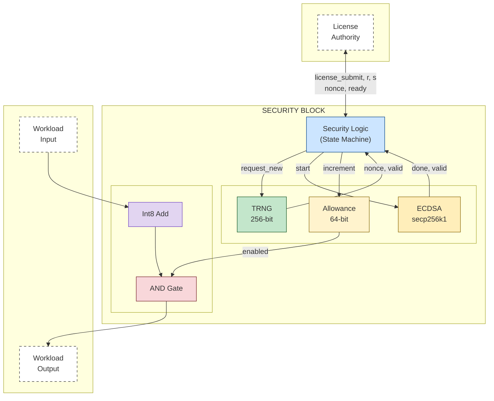
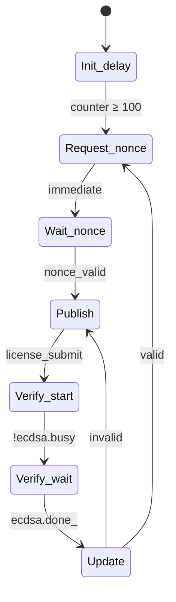
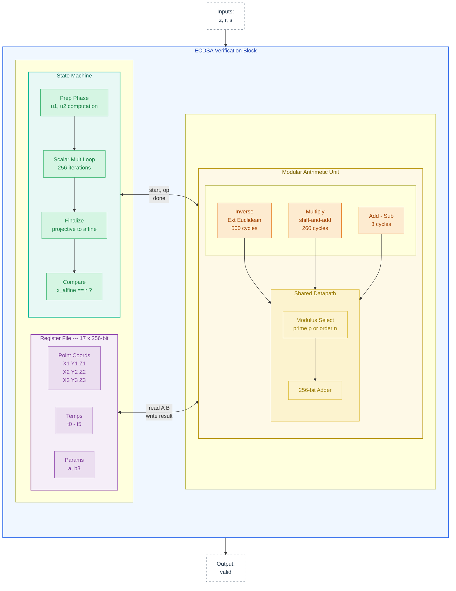

# Security Block Architecture

## Table of Contents
- [Purpose](#purpose)
- [High-Level Block Diagram](#high-level-block-diagram)
- [Data Flow](#data-flow)
- [Trust Model](#trust-model)
- [Security Properties](#security-properties)
- [Interface Specification](#interface-specification)
- [State Machine](#state-machine)
- [Timing Characteristics](#timing-characteristics)
- [Test Coverage](#test-coverage)
- [Prototype Limitations](#prototype-limitations)
- [Configuration Parameters](#configuration-parameters)
- [References](#references)

---

## Purpose

This security block implements a hardware-level "deadman's switch" for AI accelerators, based on the design described in Petrie (2025), [Embedded Off-Switches for AI Compute](https://arxiv.org/abs/2509.07637). The block gates essential chip operations, allowing them to proceed only when valid, cryptographically-signed authorization has been recently received.

The paper proposes embedding thousands of these security blocks throughout an AI chip, each independently verifying authorization. This prototype implements a single ECDSA-based block to validate the mechanism.

### Design Goals

- **Fail-secure default**: Output is blocked unless explicitly authorized
- **Cryptographic authorization**: Only holders of the private key can generate valid licenses
- **Replay prevention**: Each license is valid for exactly one nonce
- **Time-based depletion**: Authorization expires over time without renewal


---

## Quickstart

### Prerequisites

- **OCaml** (4.14+) and **opam**

### Installation

```bash
# Install opam if needed (macOS: brew install opam, Ubuntu: apt install opam)
opam init
eval $(opam env)

# Install dependencies
opam install hardcaml hardcaml_waveterm zarith

# Clone and build
git clone https://github.com/JamesPetrie/off-switch
cd off-switch
dune build
```

### Run Tests

```bash
# Run security block test suite
dune exec ./test/test_security_block.exe
```

---

## High-Level Block Diagram


*Security block architecture. The Int8 adder is a placeholder for actual chip operations (matrix multiplies, data routing, etc.). See Figure 3 in Petrie (2025) for the conceptual diagram this implements.*

### Module Summary

| Module | Type | Purpose |
|--------|------|---------|
| `Trng` | Submodule | Nonce generation (256-bit counter in prototype; ring oscillator in production) |
| `Ecdsa` | Submodule | Signature verification using secp256k1 curve |
| Security Logic | Inline | State machine orchestration (7 states) |
| Usage Allowance | Inline | 64-bit authorization counter |
| Workload | Inline | Gated essential operation (Int8 Add example) |

---

## Data Flow

### Authorization Flow

The authorization protocol follows Section 2 of the paper (see Figure 2):

1. TRNG generates nonce (at initialization or after valid license)
2. Security Logic latches and publishes nonce (`nonce_ready` = 1)
3. External authority reads nonce, signs it with private key
4. Authority submits license (r, s) via `license_submit` pulse
5. ECDSA verifies signature against nonce and hardcoded public key
6. **If valid:**
   - Allowance incremented
   - Return to step 1 (new nonce generated)
7. **If invalid:**
   - Allowance unchanged
   - Same nonce retained (allows retry with correct signature)
   - Return to step 2

### Workload Flow

1. Workload inputs (`int8_a`, `int8_b`) arrive with `workload_valid` = 1
2. Computation performed (Int8 addition, wrapping on overflow)
3. Output gating: each result bit ANDed with `enabled` signal
   - If `allowance > 0`: `enabled` = 1, result passes through
   - If `allowance = 0`: `enabled` = 0, result forced to zero
4. Result registered and output on next cycle

> **Note:** Allowance decrements every clock cycle regardless of workload activity, providing time-based authorization depletion as described in the paper's usage allowance properties.

---

## Trust Model

### Trust Boundaries

**Untrusted:**
- External license authority communication channel
- Workload inputs
- All signals crossing the security block boundary

**Trusted:**
- ECDSA verification logic
- Hardcoded public key (in ECDSA module)
- Allowance counter logic
- Output gating logic (AND gates)
- State machine transitions
- TRNG entropy source (ring oscillator in production)

### Trust Assumptions

1. The hardcoded public key corresponds to a private key held only by authorized parties.
2. ECDSA (secp256k1) is cryptographically secure—an attacker cannot forge signatures without the private key.
3. The TRNG produces non-repeating nonces, preventing replay attacks. (Predictability is not a concern; uniqueness is.)
4. The hardware implementation faithfully reflects this RTL design (no manufacturing-time tampering).

The paper's Section 4 discusses attack vectors against these assumptions in detail, including physical tampering, side-channel attacks, and supply chain compromise.

---

## Security Properties

| Property | Description | Enforcement |
|----------|-------------|-------------|
| Output Gating | Workload output is 0 when unauthorized | `result & repeat(enabled, 8)` |
| Cryptographic Authorization | Only valid signatures increment allowance | ECDSA verification before increment |
| Replay Prevention | Each license valid for one nonce only | New nonce generated only after valid license accepted |
| Time-Based Depletion | Authorization depletes continuously | Allowance decrements every clock cycle |
| Fail-Secure Default | Allowance initializes to 0 on reset | Register default value; no license = no output |
| Retry Allowed | Invalid signatures allow retry with same nonce | State returns to Publish without changing nonce |
| No Double-Spend | Same license cannot be reused | Nonce changes immediately after valid license |

---

## Interface Specification

### Top-Level Inputs

| Signal | Width | Description |
|--------|-------|-------------|
| `clock` | 1 | System clock |
| `clear` | 1 | Synchronous reset (active high) |
| `license_submit` | 1 | Pulse high for one cycle to submit license |
| `license_r` | 256 | ECDSA signature r component |
| `license_s` | 256 | ECDSA signature s component |
| `workload_valid` | 1 | Workload input data valid |
| `int8_a` | 8 | Signed 8-bit operand A |
| `int8_b` | 8 | Signed 8-bit operand B |
| `param_a` | 256 | ECDSA curve parameter a (0 for secp256k1) |
| `param_b3` | 256 | ECDSA curve parameter 3b (21 for secp256k1) |
| `trng_seed` | 256 | Seed value for TRNG (testing only) |
| `trng_load_seed` | 1 | Load seed into TRNG (testing only) |

### Top-Level Outputs

| Signal | Width | Description |
|--------|-------|-------------|
| `nonce` | 256 | Current nonce value |
| `nonce_ready` | 1 | Nonce is stable and ready for signing |
| `int8_result` | 8 | Gated workload output |
| `result_valid` | 1 | Result output is valid |
| `allowance` | 64 | Current allowance counter value |
| `enabled` | 1 | Allowance > 0 |
| `state_debug` | 4 | Current state machine state (debug) |
| `licenses_accepted` | 16 | Count of valid licenses processed (debug) |
| `ecdsa_busy` | 1 | ECDSA verification in progress (debug) |

### TRNG Submodule Interface

| Direction | Signal | Width | Description |
|-----------|--------|-------|-------------|
| Input | `clock` | 1 | System clock |
| Input | `clear` | 1 | Synchronous reset |
| Input | `enable` | 1 | Enable entropy counter |
| Input | `request_new` | 1 | Pulse to latch new nonce |
| Input | `seed` | 256 | Seed value (testing only) |
| Input | `load_seed` | 1 | Load seed (testing only) |
| Output | `nonce` | 256 | Latched nonce value |
| Output | `nonce_valid` | 1 | Nonce has been latched |

### ECDSA Submodule Interface

| Direction | Signal | Width | Description |
|-----------|--------|-------|-------------|
| Input | `clock` | 1 | System clock |
| Input | `clear` | 1 | Synchronous reset |
| Input | `start` | 1 | Pulse to begin verification |
| Input | `z` | 256 | Message hash (= nonce) |
| Input | `r` | 256 | Signature r component |
| Input | `s` | 256 | Signature s component |
| Input | `param_a` | 256 | Curve parameter a |
| Input | `param_b3` | 256 | Curve parameter 3b |
| Output | `done_` | 1 | Verification complete (pulse) |
| Output | `valid` | 1 | Signature is valid |
| Output | `busy` | 1 | Verification in progress |

---

## State Machine

### State Diagram



### State Descriptions

| State | Entry Condition | Actions | Exit Condition |
|-------|-----------------|---------|----------------|
| `Init_delay` | Reset | Increment delay counter | Counter ≥ 100 |
| `Request_nonce` | From Init_delay or Update (valid) | Assert `request_new` to TRNG | Immediate |
| `Wait_nonce` | From Request_nonce | Wait for TRNG | `nonce_valid` |
| `Publish` | From Wait_nonce or Update (invalid) | Latch nonce; `nonce_ready` = 1 | `license_submit` |
| `Verify_start` | From Publish | Latch r, s; assert `ecdsa_start` | `!ecdsa.busy` |
| `Verify_wait` | From Verify_start | Wait for ECDSA | `ecdsa.done_` |
| `Update` | From Verify_wait | If valid: increment allowance | Immediate |

---

Here's an expanded section on the ECDSA and modular arithmetic architecture to add to the README:

---

## ECDSA and Modular Arithmetic Architecture



The security block uses ECDSA signature verification on the secp256k1 curve to validate licenses. This section describes the implementation approach; for background on why public-key cryptography is preferable to symmetric alternatives, see Section 3 of Petrie (2025).

### Verification Algorithm

ECDSA verification computes:

```
R = u₁·G + u₂·Q
```

where:
- `u₁ = z · s⁻¹ mod n`
- `u₂ = r · s⁻¹ mod n`
- `G` is the generator point (hardcoded)
- `Q` is the public key (hardcoded; `Q = 2G` in prototype)
- `z` is the message hash (= nonce in prototype)
- `(r, s)` is the signature

The signature is valid if `R.x mod n == r`.

### Scalar Multiplication via Shamir's Trick

Computing `u₁·G + u₂·Q` naively would require two separate scalar multiplications followed by a point addition. Instead, we use Shamir's trick (simultaneous multi-scalar multiplication) to process both scalars in a single pass through their bits.

For each bit position `i` from 255 down to 0:
1. **Double** the accumulator point `P`
2. **Add** a precomputed point based on the bit pair `(u₁[i], u₂[i])`:
   - `(0,0)`: add nothing (skip)
   - `(1,0)`: add `G`
   - `(0,1)`: add `Q`
   - `(1,1)`: add `G+Q` (precomputed)

This reduces the operation count from ~512 point additions to ~256 point additions plus ~256 doublings, with the doublings and additions unified through a complete addition formula.

### Complete Addition Formula

Point addition uses the complete addition formulas from Renes, Costello, and Batina (2016) in projective coordinates. These formulas:
- Handle all cases uniformly (including doubling, adding the point at infinity, and adding a point to its negation)
- Avoid branching on point values, which simplifies the state machine and improves side-channel resistance
- Require only field operations (add, subtract, multiply) with no inversions during the main loop

Each point addition/doubling executes a fixed sequence of 40 field operations, implemented as a microcode program:

```ocaml
let program = [|
  { op = Op.mul; src1 = Config.x1; src2 = Config.x2; dst = Config.t0 };  (* t0 = X1·X2 *)
  { op = Op.mul; src1 = Config.y1; src2 = Config.y2; dst = Config.t1 };  (* t1 = Y1·Y2 *)
  { op = Op.mul; src1 = Config.z1; src2 = Config.z2; dst = Config.t2 };  (* t2 = Z1·Z2 *)
  (* ... 37 more operations ... *)
|]
```

The formula uses 6 temporary registers (`t0`–`t5`) plus input/output point coordinates and curve parameters, for a total of 17 registers.

### Modular Arithmetic Unit

The `Arith` module provides the four operations needed for elliptic curve arithmetic:

| Operation | Description | Algorithm |
|-----------|-------------|-----------|
| `add` | `(a + b) mod m` | Add with conditional subtraction |
| `sub` | `(a - b) mod m` | Subtract with conditional addition |
| `mul` | `(a · b) mod m` | Montgomery multiplication (256 iterations) |
| `inv` | `a⁻¹ mod m` | Extended Euclidean algorithm |

All operations work over 256-bit operands and can use either the field prime `p` or curve order `n` as the modulus:
- Point arithmetic (during scalar multiplication) uses `mod p`
- Scalar preparation (`u₁`, `u₂` computation) and final comparison use `mod n`

The arithmetic unit interfaces with a 17-register file. Operations are started with a pulse and signal completion via `done_`. Typical cycle counts:
- Add/Sub: 2–3 cycles
- Mul: ~260 cycles (bit-serial)
- Inv: ~500–600 cycles (varies with input)

### State Machine Overview

The ECDSA verification state machine proceeds through these phases:

```
Idle → Prep_op → Loop ⟷ Load → Run_add → Finalize_op → Compare → Done
         ↑__________________|
```

**Prep_op** (3 operations, using `mod n`):
1. `w = s⁻¹ mod n`
2. `u₁ = z · w mod n`
3. `u₂ = r · w mod n`

**Loop/Load/Run_add** (256 bit positions × ~40 ops each):
- For each bit position, double the accumulator and conditionally add `G`, `Q`, or `G+Q`
- Point at infinity handled via projective coordinates (`Z = 0`)

**Finalize_op** (2 operations, using `mod p`):
1. `z_inv = Z⁻¹ mod p` (convert from projective to affine)
2. `x_affine = X · z_inv mod p`

**Compare**: Check if `x_affine == r`

### Cycle Count

Total verification takes approximately 1.5–2 million cycles, dominated by the ~256 point operations in the scalar multiplication loop. At 1 GHz, this is 1.5–2 milliseconds—negligible compared to the licensing interval (minutes to days).

### Hardcoded Constants

The prototype hardcodes:
- Generator point `G` (from secp256k1 specification)
- Public key `Q = 2G` (would be chip-specific in production)
- Precomputed sum `G + Q = 3G`
- Point at infinity `(0, 1, 0)` in projective coordinates
- Field prime `p = 2²⁵⁶ - 2³² - 977`
- Curve order `n = 2²⁵⁶ - 432420386565659656852420866394968145599`

In production, `Q` would be unique per chip (or per batch) and stored in Mask ROM, as recommended in the paper. The other constants are fixed by the secp256k1 specification.

### Prototype Simplifications

This implementation omits several features needed for production:

| Feature | Prototype | Production |
|---------|-----------|------------|
| Input validation | None | Check `r, s ∈ [1, n-1]` |
| Final reduction | None | Reduce `x_affine mod n` before comparison |
| Side-channel resistance | None | Constant-time field operations |
| Public key | Single hardcoded `Q` | Configurable via Mask ROM |


---


## Timing Characteristics

| Operation | Cycles | Notes |
|-----------|--------|-------|
| Initialization delay | 100 | Configurable via `Config.init_delay_cycles` |
| Nonce generation | 2 | Request + latch |
| License verification | ~1.5–2M | ECDSA scalar multiplication dominates |
| Workload operation | 1 | Combinational add + output register |
| Allowance per license | 10¹² | Configurable via `Config.allowance_increment` |

### Allowance Calculation

For a desired licensing period *T* seconds at clock frequency *f* Hz:

```
allowance_increment = T × f
```

**Examples at 1 GHz:**
- 1 hour: 3600 × 10⁹ = 3.6 × 10¹²
- 1 day: 86400 × 10⁹ = 8.64 × 10¹³
- 1 week: 604800 × 10⁹ = 6.05 × 10¹⁴

With 64-bit allowance counter, maximum value is 2⁶⁴ - 1 ≈ 1.8 × 10¹⁹, supporting approximately 584 years at 1 GHz.

The current default of 10¹² provides approximately 17 minutes of authorization per valid license at 1 GHz.

---

## Test Coverage

### Test Cases

| # | Test Name | Description | Property |
|---|-----------|-------------|----------|
| 1 | Initial state | Allowance = 0, enabled = false | Fail-secure |
| 2 | Workload blocked | Output = 0 when allowance = 0 | Output gating |
| 3 | State machine | Reaches Publish state with valid nonce | State machine |
| 4 | Valid license | Allowance increments, accepted count increases | Crypto auth |
| 5 | Workload unblocked | Correct result after valid license | Output gating |
| 6 | Invalid license | Allowance unchanged, same nonce retained | Crypto auth, retry |
| 7 | Int8 positive | 50 + 30 = 80 | Workload |
| 8 | Int8 negative | -10 + -20 = -30 | Workload |
| 9 | Int8 mixed | 100 + -30 = 70 | Workload |
| 10 | Int8 wrapping | 127 + 1 = -128 | Workload |
| 11 | Allowance decrement | Decreases by 100 over 100 cycles | Time depletion |
| 12 | New nonce | Generated after valid license only | Replay prevention |
| 13 | Wrong nonce | License for different nonce rejected | Crypto auth |
| 14 | Replay attack | Same license rejected on second use | No double-spend |

### Property Coverage Matrix

| Property | T1 | T2 | T4 | T5 | T6 | T11 | T12 | T13 | T14 |
|----------|:--:|:--:|:--:|:--:|:--:|:---:|:---:|:---:|:---:|
| Output Gating | ● | ● | | ● | | | | | |
| Crypto Authorization | | | ● | | ● | | | ● | ● |
| Replay Prevention | | | | | | | ● | | ● |
| Time-Based Depletion | | | | | | ● | | | |
| Fail-Secure Default | ● | ● | | | | | | | |
| Retry Allowed | | | | | ● | | | | |
| No Double-Spend | | | | | | | | | ● |

---

## Prototype Limitations

This is a proof-of-concept implementation. The paper discusses broader limitations of the approach in Section 6, and Table 1 catalogs hardware attack vectors and countermeasures.

| Component | Prototype | Production |
|-----------|-----------|------------|
| TRNG | 256-bit counter | Ring oscillator(s) with XORed entropy |
| Public key | Hardcoded (Q = 2G) | Configurable via Mask ROM |
| Curve | secp256k1 only | Multiple curves for redundancy |
| Input validation | Minimal | Full range checking (r, s ∈ [1, n-1]) |
| Redundancy | Single block | Thousands of independent blocks per chip |

---

## Configuration Parameters

```ocaml
module Config = struct
  let nonce_width = 256
  let signature_width = 256
  let allowance_width = 64
  let init_delay_cycles = 100
  let allowance_increment = 1_000_000_000_000  (* ~17 min at 1GHz *)
end
```

| Parameter | Value | Description |
|-----------|-------|-------------|
| `nonce_width` | 256 | Width of nonce in bits (matches ECDSA message size) |
| `signature_width` | 256 | Width of signature components r and s |
| `allowance_width` | 64 | Width of allowance counter (supports ~584 years at 1 GHz) |
| `init_delay_cycles` | 100 | Cycles to wait after reset before requesting first nonce |
| `allowance_increment` | 10¹² | Cycles added to allowance per valid license (~17 min at 1 GHz) |

---

## References

Petrie, J. (2025). Embedded Off-Switches for AI Compute. *arXiv preprint* arXiv:2509.07637. https://arxiv.org/abs/2509.07637
