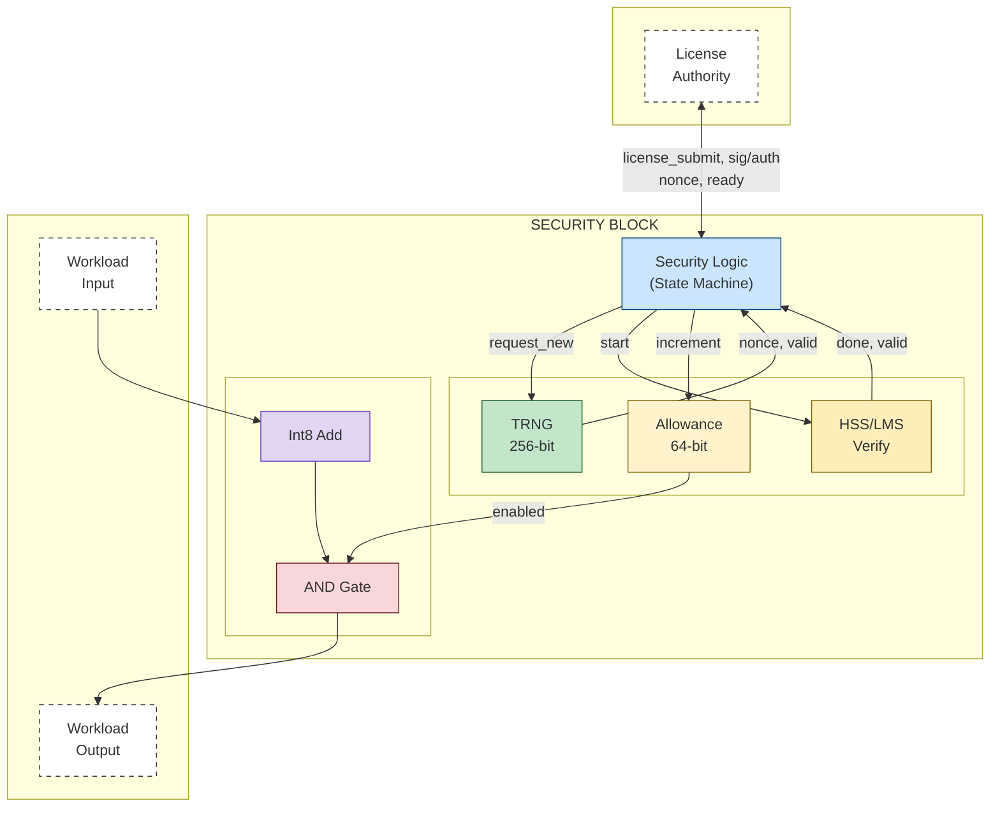
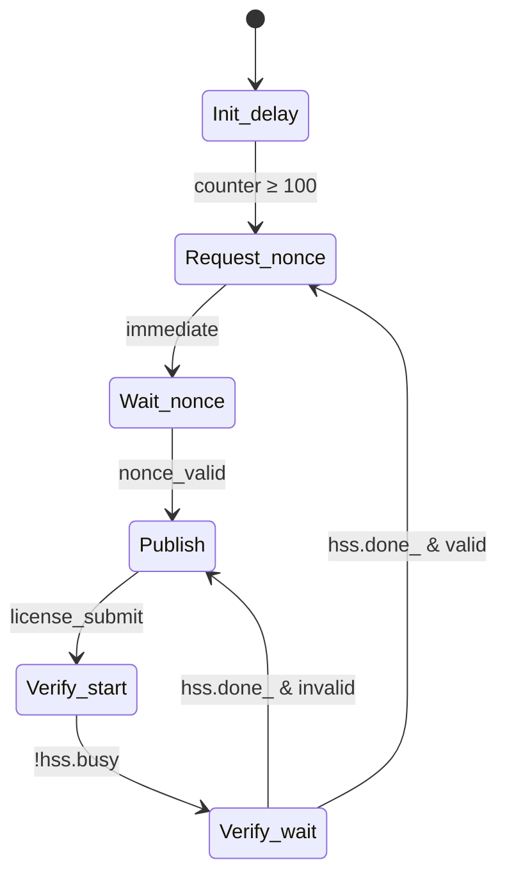
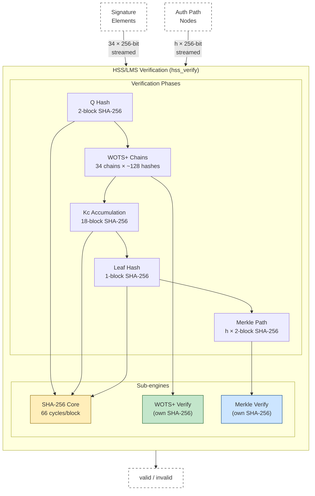

# Security Block Architecture

## Table of Contents
- [Purpose](#purpose)
- [High-Level Block Diagram](#high-level-block-diagram)
- [Data Flow](#data-flow)
- [Trust Model](#trust-model)
- [Security Properties](#security-properties)
- [Interface Specification](#interface-specification)
- [State Machine](#state-machine)
- [Timing Characteristics](#timing-characteristics)
- [Test Coverage](#test-coverage)
- [Prototype Limitations](#prototype-limitations)
- [Configuration Parameters](#configuration-parameters)
- [References](#references)

---

## Purpose

This security block implements a hardware-level "deadman's switch" for AI accelerators, based on the design described in Petrie (2025), [Embedded Off-Switches for AI Compute](https://arxiv.org/abs/2509.07637). The block gates essential chip operations, allowing them to proceed only when valid, cryptographically-signed authorization has been recently received.

The paper proposes embedding thousands of these security blocks throughout an AI chip, each independently verifying authorization. This prototype implements a single block using HSS/LMS hash-based signatures (RFC 8554) for post-quantum security.

### Design Goals

- **Fail-secure default**: Output is blocked unless explicitly authorized
- **Cryptographic authorization**: Only holders of the private key can generate valid licenses
- **Replay prevention**: Each license is valid for exactly one nonce
- **Time-based depletion**: Authorization expires over time without renewal


---

## Quickstart

### Prerequisites

- **OCaml** (4.14+) and **opam**

### Installation

```bash
# Install opam if needed (macOS: brew install opam, Ubuntu: apt install opam)
opam init
eval $(opam env)

# Install dependencies
opam install hardcaml hardcaml_waveterm ppx_hardcaml zarith 

# Clone and build
git clone https://github.com/JamesPetrie/off-switch
cd off-switch
dune build
```

### Run Tests

```bash
# Run all tests
dune exec ./test/test_sha256.exe
dune exec ./test/test_wots_verify.exe
dune exec ./test/test_merkle_verify.exe
dune exec ./test/test_hss_verify.exe
dune exec ./test/test_security_block.exe
```

---

## High-Level Block Diagram


```mermaid
flowchart TB
    subgraph external_left[" "]
        AUTH["License<br/>Authority"]:::external
    end

    subgraph SECURITY_BLOCK["SECURITY BLOCK"]
        direction TB
        SL["Security Logic<br/>(State Machine)"]:::security

        subgraph submodules[" "]
            direction LR
            TRNG["TRNG<br/>256-bit"]:::trng
            HSS["HSS/LMS<br/>Verify"]:::hss
            ALLOW["Allowance<br/>64-bit"]:::allowance
        end

        subgraph datapath[" "]
            direction LR
            ADDER["Int8 Add"]:::adder
            AND["AND Gate"]:::andgate
        end

        SL -->|request_new| TRNG
        TRNG -->|"nonce, valid"| SL
        SL -->|start| HSS
        HSS -->|"done, valid"| SL
        SL -->|increment| ALLOW
        ALLOW -->|enabled| AND
        ADDER --> AND
    end

    subgraph external_io[" "]
        direction LR
        WIN["Workload<br/>Input"]:::external
        WOUT["Workload<br/>Output"]:::external
    end

    AUTH <-->|"license_submit, sig/auth<br/>nonce, ready"| SL
    WIN --> ADDER
    AND --> WOUT

    classDef external fill:#fff,stroke:#333,stroke-dasharray: 5 5
    classDef security fill:#cce5ff,stroke:#004085
    classDef trng fill:#c3e6cb,stroke:#155724
    classDef hss fill:#ffeeba,stroke:#856404
    classDef allowance fill:#fff3cd,stroke:#856404
    classDef adder fill:#e2d5f1,stroke:#6f42c1
    classDef andgate fill:#f8d7da,stroke:#721c24
```
*Security block architecture. The Int8 adder is a placeholder for actual chip operations (matrix multiplies, data routing, etc.). See Figure 3 in Petrie (2025) for the conceptual diagram this implements.*

### Module Summary

| Module | Type | Purpose |
|--------|------|---------|
| `Trng` | Submodule | Nonce generation (256-bit counter in prototype; ring oscillator in production) |
| `Hss_verify` | Submodule | HSS/LMS signature verification (RFC 8554, L=1, w=8, n=32) |
| `Wots_verify` | Sub-submodule | WOTS+ one-time signature chain computation (34 chains) |
| `Merkle_verify` | Sub-submodule | Merkle authentication path verification |
| `Sha256_core` | Sub-submodule | SHA-256 hash engine (66 cycles/block) |
| Security Logic | Inline | State machine orchestration (6 states) |
| Usage Allowance | Inline | 64-bit authorization counter |
| Workload | Inline | Gated essential operation (Int8 Add example) |

---

## Data Flow

### Authorization Flow

The authorization protocol follows Section 2 of the paper (see Figure 2):

1. TRNG generates nonce (at initialization or after valid license)
2. Security Logic latches and publishes nonce (`nonce_ready` = 1)
3. External authority reads nonce, signs it with HSS/LMS private key
4. Authority submits license via `license_submit` pulse (leaf index + randomizer)
5. HSS verifier requests signature elements and auth path nodes via streaming interface
6. HSS verifies: Q hash -> WOTS+ chains -> Kc accumulation -> leaf hash -> Merkle path -> root comparison
7. **If valid:**
   - Allowance incremented
   - Return to step 1 (new nonce generated)
8. **If invalid:**
   - Allowance unchanged
   - Same nonce retained (allows retry with correct signature)
   - Return to step 2

### Workload Flow

1. Workload inputs (`int8_a`, `int8_b`) arrive with `workload_valid` = 1
2. Computation performed (Int8 addition, wrapping on overflow)
3. Output gating: each result bit ANDed with `enabled` signal
   - If `allowance > 0`: `enabled` = 1, result passes through
   - If `allowance = 0`: `enabled` = 0, result forced to zero
4. Result registered and output on next cycle

> **Note:** Allowance decrements every clock cycle regardless of workload activity, providing time-based authorization depletion as described in the paper's usage allowance properties.

---

## Trust Model

### Trust Boundaries

**Untrusted:**
- External license authority communication channel
- Workload inputs
- All signals crossing the security block boundary

**Trusted:**
- HSS/LMS verification logic (SHA-256, WOTS+, Merkle)
- Configured root public key and tree parameters
- Allowance counter logic
- Output gating logic (AND gates)
- State machine transitions
- TRNG entropy source (ring oscillator in production)

### Trust Assumptions

1. The configured root public key corresponds to a private key held only by authorized parties.
2. HSS/LMS (RFC 8554) is cryptographically secure—an attacker cannot forge signatures without the private key. HSS/LMS is post-quantum secure, relying only on hash function properties.
3. The TRNG produces non-repeating nonces, preventing replay attacks. (Predictability is not a concern; uniqueness is.)
4. The hardware implementation faithfully reflects this RTL design (no manufacturing-time tampering).

The paper's Section 4 discusses attack vectors against these assumptions in detail, including physical tampering, side-channel attacks, and supply chain compromise.

---

## Security Properties

| Property | Description | Enforcement |
|----------|-------------|-------------|
| Output Gating | Workload output is 0 when unauthorized | `result & repeat(enabled, 8)` |
| Cryptographic Authorization | Only valid signatures increment allowance | HSS/LMS verification before increment |
| Replay Prevention | Each license valid for one nonce only | New nonce generated only after valid license accepted |
| Time-Based Depletion | Authorization depletes continuously | Allowance decrements every clock cycle |
| Fail-Secure Default | Allowance initializes to 0 on reset | Register default value; no license = no output |
| Retry Allowed | Invalid signatures allow retry with same nonce | State returns to Publish without changing nonce |
| No Double-Spend | Same license cannot be reused | Nonce changes immediately after valid license |

---

## Interface Specification

### Top-Level Inputs

| Signal | Width | Description |
|--------|-------|-------------|
| `clock` | 1 | System clock |
| `clear` | 1 | Synchronous reset (active high) |
| `license_submit` | 1 | Pulse high for one cycle to submit license |
| `license_leaf_index` | 32 | Leaf index used for signing |
| `license_randomizer` | 256 | Signature randomizer C |
| `sig_element` | 256 | Streamed WOTS+ signature chain value |
| `sig_element_valid` | 1 | Pulse when sig_element is ready |
| `auth_node` | 256 | Streamed Merkle auth path node |
| `auth_node_valid` | 1 | Pulse when auth_node is ready |
| `root_pub_key` | 256 | HSS root public key (Merkle root) |
| `identifier` | 128 | Tree identifier I |
| `tree_height` | 6 | Merkle tree height |
| `workload_valid` | 1 | Workload input data valid |
| `int8_a` | 8 | Signed 8-bit operand A |
| `int8_b` | 8 | Signed 8-bit operand B |
| `trng_seed` | 256 | Seed value for TRNG (testing only) |
| `trng_load_seed` | 1 | Load seed into TRNG (testing only) |

### Top-Level Outputs

| Signal | Width | Description |
|--------|-------|-------------|
| `nonce` | 256 | Current nonce value |
| `nonce_ready` | 1 | Nonce is stable and ready for signing |
| `int8_result` | 8 | Gated workload output |
| `result_valid` | 1 | Result output is valid |
| `allowance` | 64 | Current allowance counter value |
| `enabled` | 1 | Allowance > 0 |
| `request_sig_element` | 1 | Requesting next signature chain element |
| `sig_element_index` | 6 | Which chain element is needed (0-33) |
| `request_auth_node` | 1 | Requesting next Merkle auth path node |
| `auth_level` | 6 | Which tree level is needed |
| `state_debug` | 4 | Current state machine state (debug) |
| `licenses_accepted` | 16 | Count of valid licenses processed (debug) |
| `hss_busy` | 1 | HSS verification in progress (debug) |

### TRNG Submodule Interface

| Direction | Signal | Width | Description |
|-----------|--------|-------|-------------|
| Input | `clock` | 1 | System clock |
| Input | `clear` | 1 | Synchronous reset |
| Input | `enable` | 1 | Enable entropy counter |
| Input | `request_new` | 1 | Pulse to latch new nonce |
| Input | `seed` | 256 | Seed value (testing only) |
| Input | `load_seed` | 1 | Load seed (testing only) |
| Output | `nonce` | 256 | Latched nonce value |
| Output | `nonce_valid` | 1 | Nonce has been latched |

### HSS/LMS Verification Submodule Interface

| Direction | Signal | Width | Description |
|-----------|--------|-------|-------------|
| Input | `clock` | 1 | System clock |
| Input | `clear` | 1 | Synchronous reset |
| Input | `start` | 1 | Pulse to begin verification |
| Input | `identifier` | 128 | Tree identifier I |
| Input | `leaf_index` | 32 | Which leaf was used to sign |
| Input | `tree_height` | 6 | Merkle tree height |
| Input | `root_pub_key` | 256 | Expected Merkle root (public key) |
| Input | `message` | 256 | Message to verify (= nonce) |
| Input | `randomizer` | 256 | Signature randomizer C |
| Input | `sig_element` | 256 | Streamed signature chain value |
| Input | `sig_element_valid` | 1 | Signature element ready |
| Input | `auth_node` | 256 | Streamed Merkle auth path node |
| Input | `auth_node_valid` | 1 | Auth path node ready |
| Output | `busy` | 1 | Verification in progress |
| Output | `done_` | 1 | Verification complete (pulse) |
| Output | `valid` | 1 | Signature is valid |
| Output | `request_sig_element` | 1 | Requesting next chain element |
| Output | `sig_element_index` | 6 | Which chain (0-33) |
| Output | `request_auth_node` | 1 | Requesting next auth node |
| Output | `auth_level` | 6 | Which tree level |

---

## State Machine

### State Diagram


```mermaid
stateDiagram-v2
    [*] --> Init_delay
    Init_delay --> Request_nonce: counter ≥ 100
    Request_nonce --> Wait_nonce: immediate
    Wait_nonce --> Publish: nonce_valid
    Publish --> Verify_start: license_submit
    Verify_start --> Verify_wait: !hss.busy
    Verify_wait --> Request_nonce: hss.done_ & valid
    Verify_wait --> Publish: hss.done_ & invalid
```

### State Descriptions

| State | Entry Condition | Actions | Exit Condition |
|-------|-----------------|---------|----------------|
| `Init_delay` | Reset | Increment delay counter | Counter ≥ 100 |
| `Request_nonce` | From Init_delay or Verify_wait (valid) | Assert `request_new` to TRNG | Immediate |
| `Wait_nonce` | From Request_nonce | Wait for TRNG | `nonce_valid` |
| `Publish` | From Wait_nonce or Verify_wait (invalid) | Latch nonce; `nonce_ready` = 1 | `license_submit` |
| `Verify_start` | From Publish | Latch leaf_index, randomizer; assert `hss_start` | `!hss.busy` |
| `Verify_wait` | From Verify_start | Wait for HSS verification (~326K cycles) | `hss.done_` |

---

## HSS/LMS Signature Verification Architecture


```mermaid
flowchart TB
    subgraph HSS["HSS/LMS Verification (hss_verify)"]
        direction TB

        subgraph phases["Verification Phases"]
            direction LR
            P1["Q Hash<br/>2-block SHA-256"]
            P2["WOTS+ Chains<br/>34 chains × ~128 hashes"]
            P3["Kc Accumulation<br/>18-block SHA-256"]
            P4["Leaf Hash<br/>1-block SHA-256"]
            P5["Merkle Path<br/>h × 2-block SHA-256"]

            P1 --> P2
            P2 --> P3
            P3 --> P4
            P4 --> P5
        end

        subgraph engines["Sub-engines"]
            direction LR
            SHA["SHA-256 Core<br/>66 cycles/block"]:::sha
            WOTS["WOTS+ Verify<br/>(own SHA-256)"]:::wots
            MERKLE["Merkle Verify<br/>(own SHA-256)"]:::merkle
        end

        P1 --> SHA
        P3 --> SHA
        P4 --> SHA
        P2 --> WOTS
        P5 --> MERKLE
    end

    SIG["Signature<br/>Elements"]:::external -->|"34 × 256-bit<br/>streamed"| HSS
    AUTH["Auth Path<br/>Nodes"]:::external -->|"h × 256-bit<br/>streamed"| HSS
    HSS --> RESULT["valid / invalid"]:::external

    classDef sha fill:#ffeeba,stroke:#856404
    classDef wots fill:#c3e6cb,stroke:#155724
    classDef merkle fill:#cce5ff,stroke:#004085
    classDef external fill:#fff,stroke:#333,stroke-dasharray: 5 5
```

The security block uses HSS/LMS hash-based signature verification (RFC 8554) to validate licenses. HSS/LMS is a post-quantum scheme whose security relies solely on the collision resistance of SHA-256, making it resistant to attacks from quantum computers. For background on why public-key cryptography is preferable to symmetric alternatives, see Section 3 of Petrie (2025).

### Parameters

| Parameter | Value | Description |
|-----------|-------|-------------|
| L | 1 | Single Merkle tree (no multi-level HSS) |
| w | 8 | Winternitz parameter (base-256 digits) |
| n | 32 | Hash output length in bytes (full SHA-256) |
| p | 34 | Total WOTS+ chains (32 message + 2 checksum) |
| h | configurable | Merkle tree height (4 in tests) |

### Verification Algorithm

HSS/LMS verification for a signature on message `M` with randomizer `C`:

1. **Q hash**: `Q = SHA-256(I || q || D_MESG || C || M)` (86 bytes, 2 blocks)
2. **WOTS+ chains**: For each of 34 chains, hash from signature position `d[i]` to position 254: `H(I || q || i || j || tmp)` (55 bytes, 1 block per step, ~4335 hashes average)
3. **Kc accumulation**: `Kc = SHA-256(I || q || D_PBLC || pk[0] || ... || pk[33])` (1110 bytes, 18 blocks, computed incrementally as chains complete)
4. **Leaf hash**: `leaf = SHA-256(I || q || D_LEAF || Kc)` (54 bytes, 1 block)
5. **Merkle path**: Walk from leaf to root using auth path siblings, `H(I || node_num || D_INTR || left || right)` (86 bytes, 2 blocks per level)
6. **Compare**: Computed root == configured root public key?

### Architecture

The HSS orchestrator (`hss_verify.ml`) owns a SHA-256 core for phases 1, 3, and 4, and instantiates two sub-engines:

- **WOTS+ engine** (`wots_verify.ml`): Owns its own SHA-256 core. Extracts 34 digits from Q (32 message bytes + 2 checksum bytes), requests signature elements via streaming interface, computes chain hashes, and outputs pk candidates with flow control (`pk_candidate_valid`/`pk_ack`).

- **Merkle engine** (`merkle_verify.ml`): Owns its own SHA-256 core. Takes the leaf hash and tree parameters, requests auth path nodes via streaming interface, and computes the root hash.

The Kc accumulation runs concurrently with WOTS+ chain computation: even-indexed pk elements are buffered, and each odd-indexed pk triggers a 512-bit SHA-256 block feed. This pipelines Kc hashing with chain computation.

### SHA-256 Core

Ported from [secworks/sha256](https://github.com/secworks/sha256) (Verilog) to HardCaml:

- 3-state FSM: Idle -> Rounds (64 cycles) -> Done
- 66 cycles per 512-bit block (1 init + 64 rounds + 1 done)
- 16-register sliding window for W message schedule
- Supports multi-block hashing via `init`/`next` signals

### Cycle Count

Total verification takes approximately **326,000 cycles**, dominated by WOTS+ chain computation:

| Phase | Cycles | Notes |
|-------|--------|-------|
| Q hash | ~132 | 2 SHA-256 blocks |
| WOTS+ chains | ~286,000 | ~4335 hashes avg × 66 cycles |
| Kc accumulation | ~1,188 | 18 SHA-256 blocks (pipelined with WOTS) |
| Leaf hash | ~66 | 1 SHA-256 block |
| Merkle path (h=4) | ~528 | 4 levels × 2 blocks × 66 cycles |
| Overhead | ~38,000 | State transitions, flow control |

At 1 GHz, verification completes in ~0.33 ms, well within the licensing interval (minutes to days).


---


## Timing Characteristics

| Operation | Cycles | Notes |
|-----------|--------|-------|
| Initialization delay | 100 | Configurable via `Config.init_delay_cycles` |
| Nonce generation | 2 | Request + latch |
| License verification | ~326,000 | HSS/LMS: WOTS+ chains dominate |
| Workload operation | 1 | Combinational add + output register |
| Allowance per license | 10¹² | Configurable via `Config.allowance_increment` |

### Allowance Calculation

For a desired licensing period *T* seconds at clock frequency *f* Hz:

```
allowance_increment = T × f
```

**Examples at 1 GHz:**
- 1 hour: 3600 × 10⁹ = 3.6 × 10¹²
- 1 day: 86400 × 10⁹ = 8.64 × 10¹³
- 1 week: 604800 × 10⁹ = 6.05 × 10¹⁴

With 64-bit allowance counter, maximum value is 2⁶⁴ - 1 ≈ 1.8 × 10¹⁹, supporting approximately 584 years at 1 GHz.

The current default of 10¹² provides approximately 17 minutes of authorization per valid license at 1 GHz.

---

## Test Coverage

### Security Block Test Cases

| # | Test Name | Description | Property |
|---|-----------|-------------|----------|
| 1 | Initial state | Allowance = 0, enabled = false | Fail-secure |
| 2 | Workload blocked | Output = 0 when allowance = 0 | Output gating |
| 3 | State machine | Reaches Publish state, nonce matches calibrated value | State machine |
| 4 | Valid license | Allowance increments, accepted count increases | Crypto auth |
| 5 | Workload unblocked | Correct result after valid license | Output gating |
| 6 | Invalid license | Allowance unchanged (wrong randomizer) | Crypto auth, retry |
| 7 | Int8 positive | 50 + 30 = 80 | Workload |
| 8 | Int8 negative | -10 + -20 = -30 | Workload |
| 9 | Int8 mixed | 100 + -30 = 70 | Workload |
| 10 | Int8 wrapping | 127 + 1 = -128 | Workload |
| 11 | Allowance decrement | Decreases by 100 over 100 cycles | Time depletion |
| 12 | New nonce | Generated after valid license only | Replay prevention |
| 13 | Wrong leaf index | License with wrong leaf index rejected | Crypto auth |
| 14 | Replay attack | Same license rejected on second use | No double-spend |

### Component Test Suites

| Test | Description | Vectors |
|------|-------------|---------|
| `test_sha256` | SHA-256 core against NIST vectors | 4 tests (empty, "abc", 2-block, multi-block) |
| `test_wots_verify` | WOTS+ chain computation | 34 chains vs reference_lms.py vectors |
| `test_merkle_verify` | Merkle path verification | Height-4 tree, root comparison |
| `test_hss_verify` | End-to-end HSS orchestrator | Full Q->WOTS->Kc->leaf->Merkle pipeline |
| `test_security_block` | Security block integration | 14 tests with TRNG calibration |

### Property Coverage Matrix

| Property | T1 | T2 | T4 | T5 | T6 | T11 | T12 | T13 | T14 |
|----------|:--:|:--:|:--:|:--:|:--:|:---:|:---:|:---:|:---:|
| Output Gating | ● | ● | | ● | | | | | |
| Crypto Authorization | | | ● | | ● | | | ● | ● |
| Replay Prevention | | | | | | | ● | | ● |
| Time-Based Depletion | | | | | | ● | | | |
| Fail-Secure Default | ● | ● | | | | | | | |
| Retry Allowed | | | | | ● | | | | |
| No Double-Spend | | | | | | | | | ● |

---

## Prototype Limitations

This is a proof-of-concept implementation. The paper discusses broader limitations of the approach in Section 6, and Table 1 catalogs hardware attack vectors and countermeasures.

| Component | Prototype | Production |
|-----------|-----------|------------|
| TRNG | 256-bit counter | Ring oscillator(s) with XORed entropy |
| Public key | Configured at runtime | Mask ROM per chip/batch |
| Hash function | SHA-256 (n=32) | Potentially truncated (n=20) for smaller signatures |
| HSS levels | L=1 (single tree) | L=2 for larger key space |
| Key management | Stateless | Stateful with key stretching |
| Side-channel resistance | None | Constant-time SHA-256, power analysis hardening |
| Redundancy | Single block | Thousands of independent blocks per chip |
| Interface | Direct signals | SPI/streaming with buffered signature data |

---

## Configuration Parameters

```ocaml
module Config = struct
  let nonce_width = 256
  let allowance_width = 64
  let init_delay_cycles = 100
  let allowance_increment = 1_000_000_000_000  (* ~17 min at 1GHz *)
end
```

| Parameter | Value | Description |
|-----------|-------|-------------|
| `nonce_width` | 256 | Width of nonce in bits (message to be signed) |
| `allowance_width` | 64 | Width of allowance counter (supports ~584 years at 1 GHz) |
| `init_delay_cycles` | 100 | Cycles to wait after reset before requesting first nonce |
| `allowance_increment` | 10¹² | Cycles added to allowance per valid license (~17 min at 1 GHz) |

---

## References

Petrie, J. (2025). Embedded Off-Switches for AI Compute. *arXiv preprint* arXiv:2509.07637. https://arxiv.org/abs/2509.07637

McGrew, D., Curcio, M., & Fluhrer, S. (2019). Leighton-Micali Hash-Based Signatures. *RFC 8554*. https://www.rfc-editor.org/rfc/rfc8554

Cooper, D. A., et al. (2020). Recommendation for Stateful Hash-Based Signature Schemes. *NIST SP 800-208*. https://nvlpubs.nist.gov/nistpubs/SpecialPublications/NIST.SP.800-208.pdf
